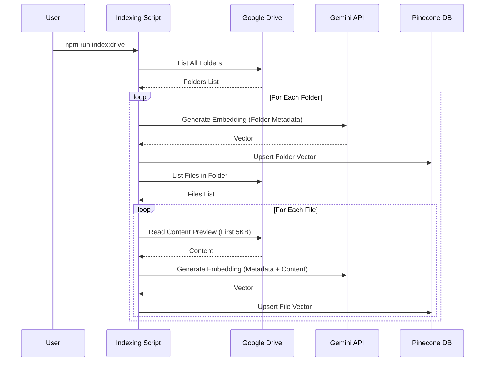
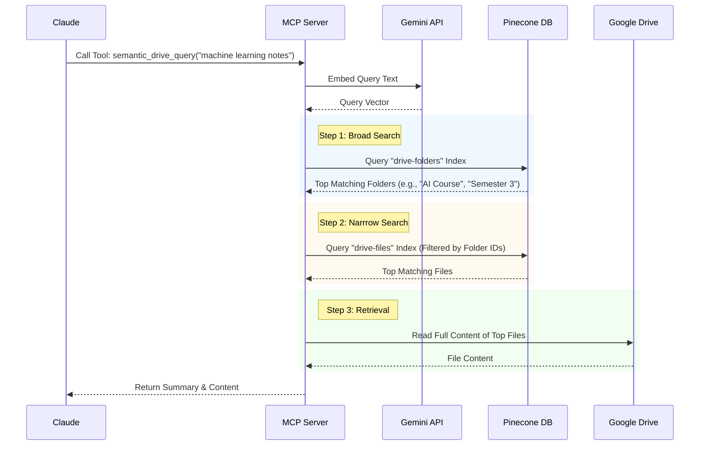

# Google Drive MCP Server Documentation

## 1. Aim
The primary aim of this project is to bridge the gap between Large Language Models (LLMs) like Claude and personal Google Drive data. By implementing the **Model Context Protocol (MCP)**, it allows AI assistants to securely access, search, and read files from Google Drive, enabling them to answer questions based on the user's private documents. The project specifically aims to solve the problem of "information overload" in large drives by implementing **semantic search**, allowing users to find files using natural language (e.g., "find my notes on machine learning") rather than just exact keywords.

## 2. Objectives
-   **Seamless Integration**: Provide a standard MCP server interface that any MCP-compliant client (like Claude Desktop) can connect to.
-   **Semantic Discovery**: Implement a robust semantic search system using vector embeddings to retrieve relevant documents based on meaning, not just filenames.
-   **Efficiency**: Minimize API costs and latency by using a two-tier retrieval strategy (Folders &rarr; Files) to avoid scanning unrelated directories.
-   **Security**: Ensure secure authentication with Google Drive using OAuth 2.0 and run locally to keep tokens on the user's machine.
-   **Extensibility**: Create a modular codebase where new tools and capabilities can be added easily.

## 3. Architecture

The system is built as a Node.js application implementing the MCP specification. It orchestrates interactions between the MCP Client (Claude), Google Drive API, Pinecone (Vector DB), and Google Gemini (Embeddings).

```mermaid
graph TD
    subgraph "Local Environment"
        Client[MCP Client (Claude Desktop)]
        Server[Google Drive MCP Server]
        Auth[Token Generator / OAuth]
    end

    subgraph "External Services"
        GDrive[Google Drive API]
        Pinecone[Pinecone Vector DB]
        Gemini[Google Gemini API]
    end

    Client <-->|Stdio / JSON-RPC| Server
    Auth -->|Generates Token| Server
    
    Server -->|Read/List Files| GDrive
    Server -->|Generate Embeddings| Gemini
    Server -->|Store/Retrieve Vectors| Pinecone
```

### Key Components
1.  **MCP Server (`src/index.ts`)**: The entry point that initializes the MCP server, loads environment variables, and registers tools.
2.  **Tool Registry (`src/tools/`)**: Defines the capabilities exposed to the LLM (e.g., `semantic_drive_query`, `read-file-content`).
3.  **Google Client (`src/google/`)**: Handles OAuth authentication and raw calls to the Google Drive API.
4.  **Semantic Indexer (`src/services/`)**: A background service that traverses the Drive, reads file content, generates summaries, creates embeddings, and updates the vector database.
5.  **Vector Store (`src/lib/pinecone.ts`)**: Manages the interaction with Pinecone for storing and retrieving folder/file embeddings.

## 4. Workflows

### 4.1. Indexing Flow
Before semantic search works, the data must be indexed. This process converts file metadata and content previews into vectors.



### 4.2. Semantic Query Flow
When a user asks Claude to find something, the `semantic_drive_query` tool is invoked.



## 5. How It Works

The project functionality is split into two main modes:

### Basic Mode (Direct API Access)
Standard tools allow the LLM to navigate the drive like a filesystem:
-   **`list-all-folders`**: Returns a raw list of all folders.
-   **`list-files-in-folder`**: Given a folder ID, lists its files.
-   **`read-file-content`**: Downloads and extracts text from a specific file ID (supports PDF, Docs, Text).

### Semantic Mode (AI-Powered)
To handle large drives where traversing every folder is too slow for an LLM, the project uses a **Two-Stage Retrieval** process:
1.  **Folder-Level Search**: The query is first compared against folder summaries. This identifies the "neighborhood" of relevant information (e.g., searching for "receipts" pins down the "Finance" folder).
2.  **File-Level Search**: The search is then restricted to files *within* those identified folders. This significantly reduces false positives and provides contextually relevant results.

The system uses **Google Gemini** for creating high-quality text embeddings and **Pinecone** as the serverless vector database to store them.

## 6. Steps to Run Locally

### Prerequisites
-   Node.js installed (v18+ recommended)
-   Google Cloud Project with Drive API enabled
-   Pinecone Account (Free tier works)
-   Google AI Studio Account (for Gemini API)

### Step 1: Clone and Install
```bash
git clone <repository-url>
cd googleDriveMCP
npm install
```

### Step 2: Configure Environment
Create a `.env` file in the root directory:
```env
# Google OAuth
CLIENT_ID=your_google_client_id
CLIENT_SECRET=your_google_client_secret
REDIRECT_URI=http://localhost:3000

# AI Services
PINECONE_API_KEY=your_pinecone_key
GEMINI_API_KEY=your_gemini_key
EMBEDDING_MODEL=text-embedding-004

# Pinecone Config
PINECONE_INDEX_FOLDERS=drive-folders
PINECONE_INDEX_FILES=drive-files
```

### Step 3: Setup Google Credentials
1.  Go to [Google Cloud Console](https://console.cloud.google.com/).
2.  Create a project -> Enable **Google Drive API**.
3.  Go to **Credentials** -> Create **OAuth Client ID** -> Type: **Desktop App**.
4.  Copy Client ID/Secret to `.env`.
5.  Run the token generator:
    ```bash
    npm run tokenGenerator
    ```
6.  Follow the browser prompt to log in. A `token.json` file will be created.

### Step 4: Initialize Semantic Index (First Run)
Create two indexes in Pinecone named `drive-folders` and `drive-files` (Dimensions: 768 for `text-embedding-004`).

Then run the indexer:
```bash
npm run index:drive
```
*Wait for this to complete. It will scan your drive and populate Pinecone.*

### Step 5: Build and Connect
1.  Build the server:
    ```bash
    npm run build
    ```
2.  Configure your MCP Client (e.g., Claude Desktop). Edit `claude_desktop_config.json`:
    ```json
    {
      "mcpServers": {
        "googleDrive": {
          "command": "node",
          "args": ["/absolute/path/to/googleDriveMCP/build/index.js"],
          "env": {
             "PINECONE_API_KEY": "...",
             "GEMINI_API_KEY": "..."
             // ... include other env vars here if not loading from .env automatically
          }
        }
      }
    }
    ```
3.  Restart Claude Desktop. The tools (including `semantic_drive_query`) should now be available.
